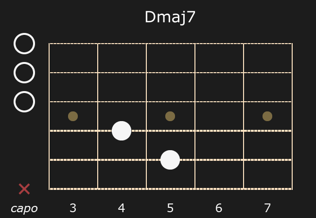

# Chord Analyzer
***beta-test***

Package provides method for analyzing chord based on guitar fingering pattern.
It also includes methods for building chord tab and PNG image.

The guitar fingering pattern consist of the string pattern like "34353X"
from highest to lowest string and offset fret number.
The method returns interval information about chord: root, quality, extension, alteration
and omission. It also returns other chords, that can be constructed based on used notes. 

### Example:
```
pattern := "00023X"
fret := 2
capo := true
chord := analyzer.NewChordInfo(pattern, fret, capo)
names, err := chord.GetNames()
if err != nil {...}
	
fmt.Printf("Base chord:\nRoot: %s, Quality: %s, Extension: %s, Alteration: %s, Omission: %s\n",
    names.Base.Root, names.Base.Quality, names.Base.Extended, names.Base.Altered, names.Base.Omitted)
for _, name := range names.Variations {
    fmt.Printf("\tChord:\n\tRoot: %s, Quality: %s, Extension: %s, Alteration: %s, Omission: %s\n",
	name.Root, name.Quality, name.Extended, name.Altered, name.Omitted)
}
```
**Result:**
```
Base chord:
Root: D, Quality: , Extension: maj7, Alteration: , Omission:
        Chord:
        Root: F#, Quality: m, Extension: b6, Alteration: , Omission:
        Chord:
        Root: C#, Quality: sus4, Extension: b6, Alteration: #5,b9, Omission:
        Chord:
        Root: A, Quality: , Extension: 6/11, Alteration: , Omission:

```

A chord name is necessary to build tab and image. To get name from analyzed chord,
you can use 'BuildName' method.

```
name := names.Base.BuildName() // Dmaj7
```

"WithName" method allows you to use "BuildTab" and "BuildChord" methods.
You can use your own name, if you are not agree with analyzed name

```
chordWithName, err := chord.WithName(name)
if err != nil {...}
tab := chordWithName.BuildTab()
fmt.Println(tab)
```
**Result:**
```
Dmaj7
0|---|---|---|---|---|
0|---|---|---|---|---|
0|---|---|---|---|---|
-|---|-#-|---|---|---|
-|---|---|-#-|---|---|
X|---|---|---|---|---|
c  3   4   5   6   7

// "c" is for capo
```
"BuildPNG" returns []byte, so it can be written to any output.
Result image resolution is 475x400 px
```
file, err := os.Create("result.png")
if err != nil {...}
img, err := chordWithName.BuildPNG()
if err != nil {...}
_, err = file.Write(img)
if err != nil {...}
````
**Result:**

